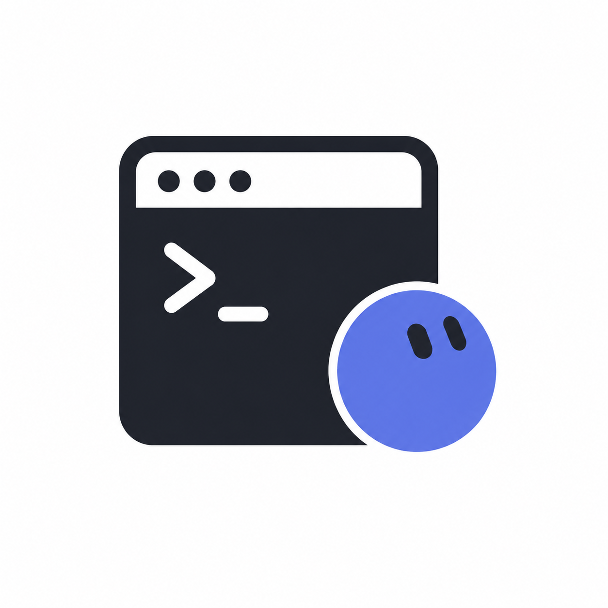
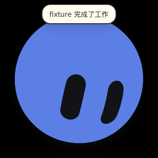
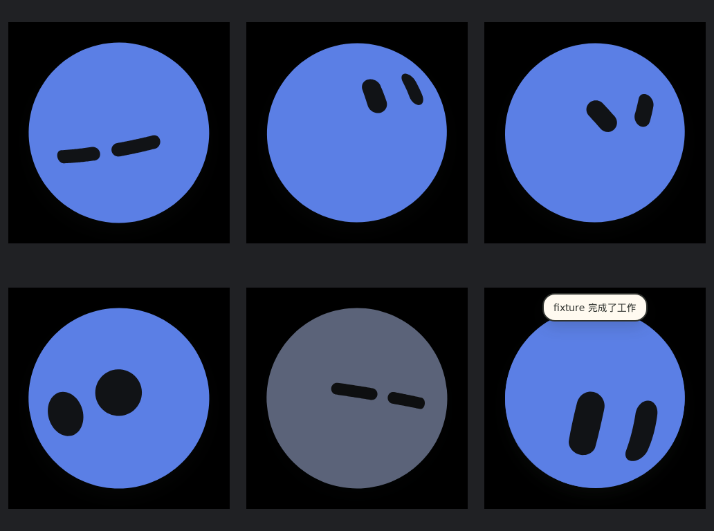
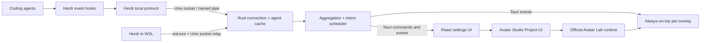

<p align="center">
  
</p>

<h1 align="center">Herdr Pet</h1>

Herdr Pet turns live [Herdr](https://github.com/herdr-dev/herdr) agent activity into an animated desktop companion. It stays in a transparent, always-on-top window and reacts when an agent starts working, needs attention, completes a turn, disconnects, or becomes idle.

Built with Tauri 2, Rust, React, and TypeScript, the application keeps the desktop shell small while using the official [Bible Strong Avatar Lab](https://github.com/smontlouis/bible-strong-avatar-lab) browser runtime for procedural SVG avatars and animations.

<p align="center">
  
  &nbsp;&nbsp;&nbsp;
  
</p>

<p align="center"><em>Working on the left; celebrating a completed turn on the right.</em></p>



<p align="center"><em>Representative states captured from the real transparent desktop overlay.</em></p>

## At a glance

- **Agent activity at a glance:** turn Herdr's background agent events into persistent states and short reaction animations.
- **A real desktop pet:** transparent, frameless, draggable, always on top, and absent from the taskbar.
- **Multi-agent aware:** aggregate many agents without allowing a burst of completion events to overwhelm the animation queue.
- **Custom avatars:** import Avatar Studio Project v2 JSON and render it with the official Avatar Lab runtime.
- **Local by design:** communicate with Herdr over a local Unix socket or Windows named pipe; WSL mode uses a process-bound `wsl.exe` bridge without opening a TCP port.
- **Cross-platform:** build raw executables for Linux, Windows, and macOS.

## Third-party integration

### Herdr

[Herdr](https://github.com/herdr-dev/herdr) observes coding agents and exposes their state through a documented local protocol. Herdr Pet subscribes to that protocol, maintains an in-memory agent cache, detects meaningful transitions, and converts them into pet states or transient animation intents.

The aggregate state priority is designed to keep important information visible:

```text
needs attention > working > idle
```

Connection loss is represented as `offline`, while a paused or deliberately quiet pet can use `sleeping`. Turn-completion events are merged within a configurable interval so several agents finishing together produce one bounded celebration rather than a rapidly growing queue.

The Herdr source used as the protocol reference and for integration fixtures is vendored at [`third-party/herdr`](third-party/herdr). It is licensed under Apache-2.0.

### Bible Strong Avatar Lab

Herdr Pet directly integrates the official procedural exporter and browser runtime from [Bible Strong Avatar Lab](https://github.com/smontlouis/bible-strong-avatar-lab). The runtime generates Avatar Data v1 from an Avatar Studio Project v2 document and renders the resulting animated SVG inside the system WebView.

Imported project files are copied into the application's data directory, so the pet does not depend on the original JSON file remaining accessible. Herdr Pet adds runtime controls for animation speed, frame rate, reduced motion, reliable pause behavior, and stable near-spherical rendering; the upstream Avatar Data and Studio Project formats remain unchanged.

The pinned source is available at [`third-party/avatar-lab`](third-party/avatar-lab) under AGPL-3.0-only. Exact revisions, local modifications, and license paths are documented in [`THIRD_PARTY_NOTICES.md`](THIRD_PARTY_NOTICES.md).

## Features

### Desktop companion

- Transparent, frameless, always-on-top overlay
- Free dragging with saved monitor-aware position
- Adjustable scale from 30% to 200% and opacity from 35% to 100%
- Optional position lock and mouse click-through
- Configurable global show/hide shortcut (`Cmd/Ctrl+Shift+H` by default)
- System tray controls and optional launch at login

### Agent reactions

- Persistent animations for sleeping, idle, working, attention required, and offline states
- Transient reactions for agent detection, work starting, turn completion, reconnection, and exit
- Multi-agent filtering and aggregation
- Priority scheduling, completion batching, queue limits, cooldowns, and configurable event rules
- Optional speech bubbles and notification sounds

### Customization and settings

- Native Avatar Studio Project v2 JSON import
- Animation-to-event mapping with a live preview
- Animation speed, frame-rate, reduced-motion, size, and opacity controls
- Tabbed settings interface in English and Simplified Chinese
- WSL connection mode for a Windows-native pet with Herdr running inside WSL
- Redacted diagnostic export for troubleshooting

## Architecture



| Layer | Responsibility |
| --- | --- |
| **Tauri 2 shell** | Window lifecycle, tray, global shortcut, autostart, native file dialog, and platform integration |
| **Rust core** | Herdr discovery and transport, WSL relay, agent cache, transition detection, configuration, avatar storage, and diagnostics |
| **React + TypeScript** | Tabbed settings, live preview, overlay state, and animation scheduling |
| **Avatar Lab runtime** | Procedural SVG generation, animation playback, blinking, ambient motion, and runtime controls |
| **Local persistence** | Versioned JSON configuration, window position, and installed avatar projects in the platform application-data directory |

The application normally creates only the pet overlay. Run it with `--settings`, or use the tray menu, to create the settings WebView on demand.

## Development setup

### Prerequisites

- [Node.js](https://nodejs.org/) 24 and npm
- [Rust](https://rustup.rs/) stable, version 1.85 or newer
- Platform dependencies required by [Tauri 2](https://v2.tauri.app/start/prerequisites/)

#### Ubuntu / Debian

```bash
sudo apt-get update
sudo apt-get install -y \
  build-essential pkg-config libdbus-1-dev libgtk-3-dev \
  libwebkit2gtk-4.1-dev libayatana-appindicator3-dev librsvg2-dev
```

#### Windows

Install the Microsoft C++ Build Tools and Rust's MSVC toolchain. WebView2 is included with current Windows 10 and Windows 11 installations; install the WebView2 Runtime separately if it is unavailable.

#### macOS

Install the Xcode Command Line Tools:

```bash
xcode-select --install
```

### Clone and run

```bash
git clone https://github.com/Kherrisan/herdr-pet.git
cd herdr-pet
npm ci
npm run tauri dev
```

Herdr Pet discovers Herdr in this order:

1. The explicit socket path saved in the application settings
2. `HERDR_SOCKET_PATH`
3. The explicit or environment-provided Herdr session
4. `~/.config/herdr/herdr.sock`

A named session resolves to `~/.config/herdr/sessions/<name>/herdr.sock`. On Windows, the matching `interprocess` namespace resolves to a named pipe.

For Windows + WSL, enable **WSL mode** in the connection settings. You may optionally select a distribution and Linux socket path; leaving them empty uses the default distribution and normal Herdr discovery. The WSL distribution must provide `nc` with Unix-socket support:

```bash
sudo apt-get install netcat-openbsd
```

### Test and validate

```bash
npm test
npm run build
cargo test --manifest-path src-tauri/Cargo.toml
cargo clippy --manifest-path src-tauri/Cargo.toml \
  --all-targets --all-features -- -D warnings
```

Protocol, aggregation, state-transition, and rule-engine tests can run without GTK/WebKitGTK:

```bash
cargo test --manifest-path src-tauri/Cargo.toml --no-default-features
```

Additional desktop checks are available when their Linux display dependencies are installed:

```bash
npm run perf:smoke -- --build
npm run stress:linux -- --build
npm run runtime:self-test:linux -- --build
npm run visual:capture:linux
```

The visual capture uses an isolated Xvfb/Openbox session and a fake Herdr server. Runtime self-tests exercise the actual system WebView rather than a DOM-only substitute.

### Build an executable

Build a native release executable without an installer:

```bash
npm run tauri build -- --no-bundle
```

The executable is written below `src-tauri/target/release/`. The `Build executables` GitHub Actions workflow produces Linux x86_64, Windows x86_64, and both Apple Silicon and Intel macOS artifacts on tags matching `v*` or by manual dispatch.

The project currently distributes raw executables rather than `.deb`, MSI/NSIS, DMG, or other installer packages. A Windows GNU cross-build may require the generated `WebView2Loader.dll` beside `herdr-pet.exe`; native Windows CI builds use the normal Windows toolchain.

## Platform notes

- **Linux X11:** supports the full overlay positioning and global-shortcut behavior.
- **Linux Wayland:** avatar rendering works, but compositor security policies may limit absolute positioning and global shortcuts.
- **Windows:** supports native Herdr named pipes and the optional WSL bridge.
- **macOS:** uses WKWebView and the platform's always-on-top window behavior.

## License

Herdr Pet is licensed under **GNU AGPL v3.0-only**. See [`LICENSE`](LICENSE) and [`THIRD_PARTY_NOTICES.md`](THIRD_PARTY_NOTICES.md) for the project and dependency license details.
